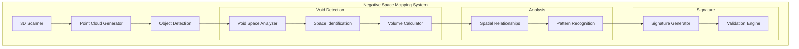
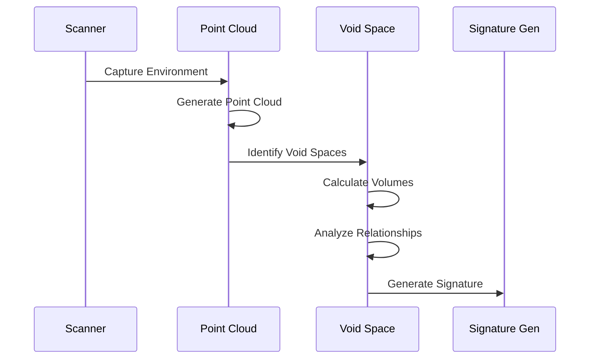

```mermaid
graph LR
    subgraph Space Detection
        A[Scan Input] --> B[Object Detection]
        B --> C[Void Mapping]
        C --> D[Space Analysis]
    end
    
    subgraph Relationship Analysis
        E[Space Data] --> F[Pattern Detection]
        F --> G[Relationship Mapping]
        G --> H[Signature Creation]
    end
