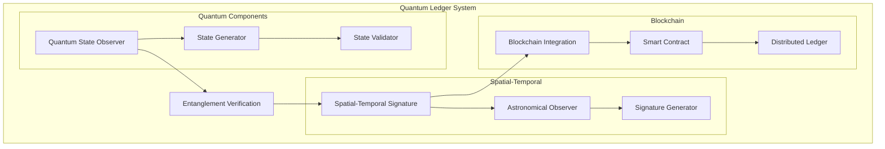
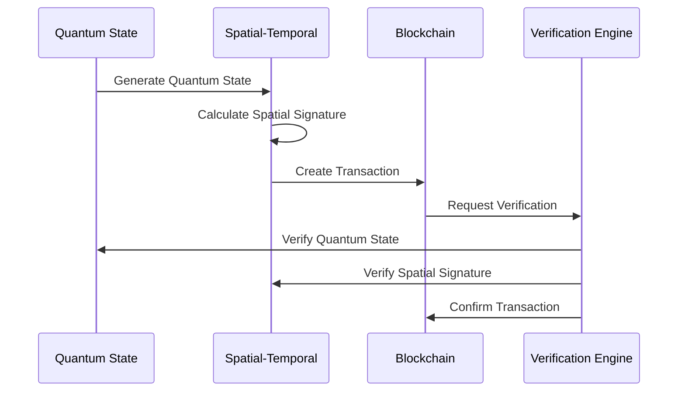

```mermaid
graph LR
    subgraph Record Creation
        A[Input Data] --> B[Quantum Entanglement]
        B --> C[Spatial Signature]
        C --> D[Blockchain Record]
    end
    
    subgraph Verification
        E[Verify Request] --> F[Check Quantum State]
        F --> G[Validate Signature]
        G --> H[Confirm Record]
    end
