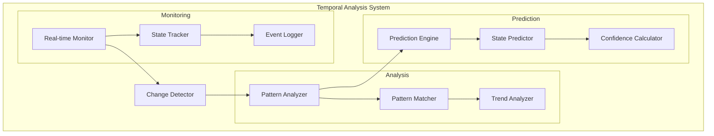
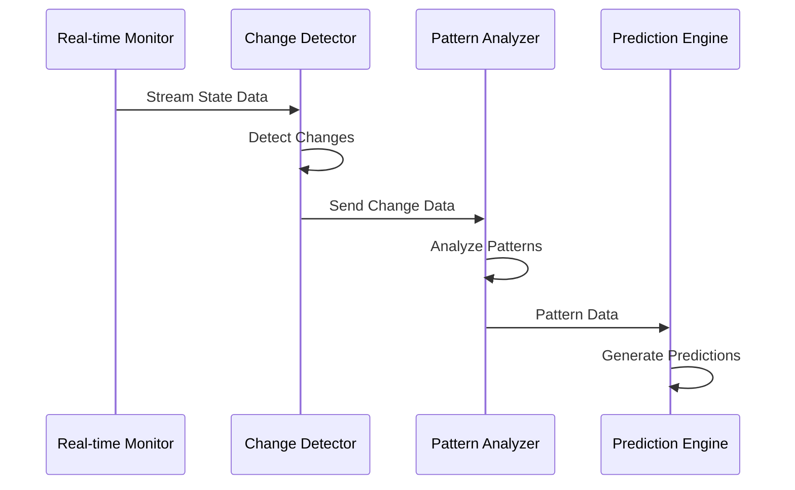

```mermaid
graph LR
    subgraph Temporal Monitoring
        A[State Input] --> B[Change Detection]
        B --> C[Pattern Analysis]
        C --> D[Prediction]
    end
    
    subgraph Pattern Recognition
        E[Time Series] --> F[Feature Extraction]
        F --> G[Pattern Matching]
        G --> H[Prediction Generation]
    end
